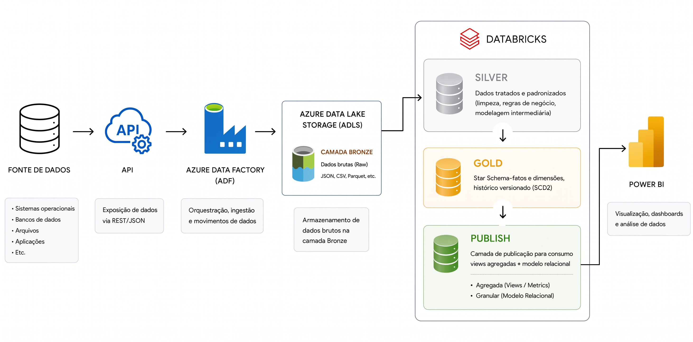
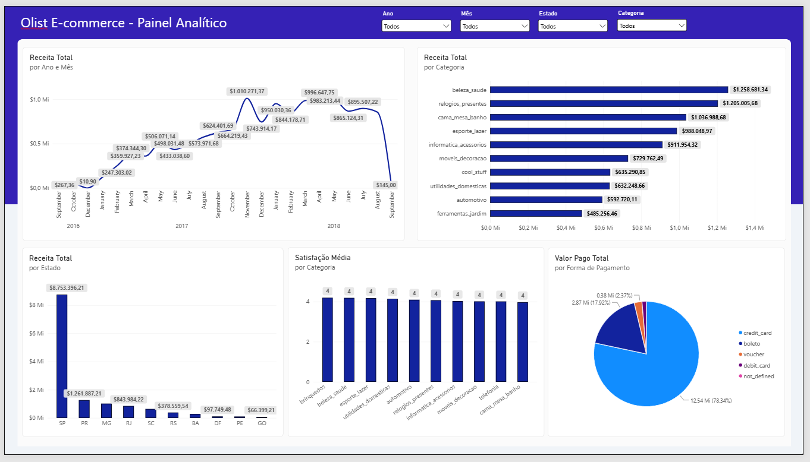
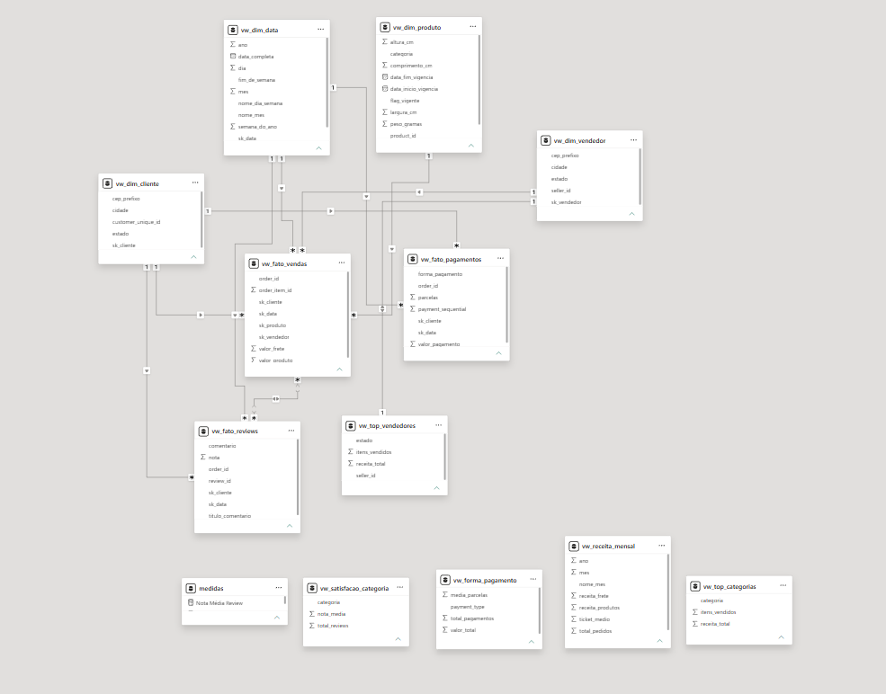
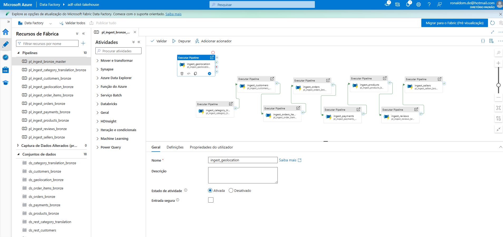
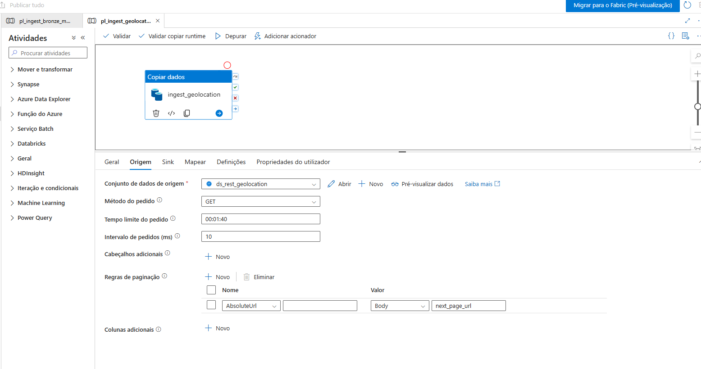
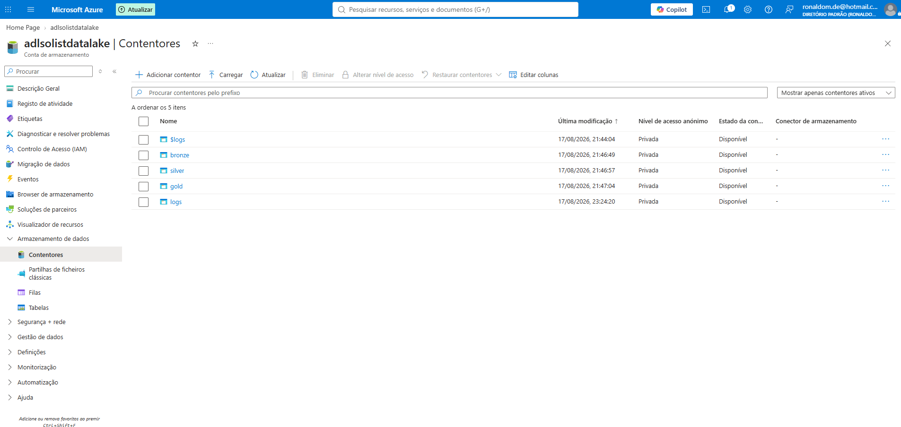
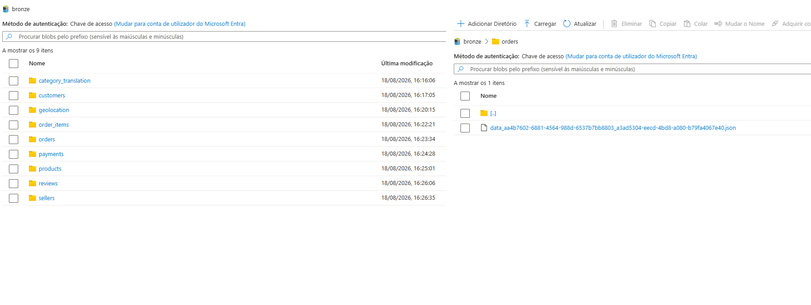
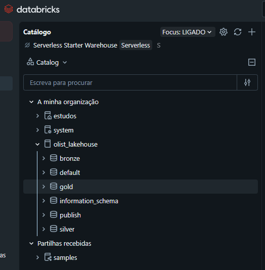
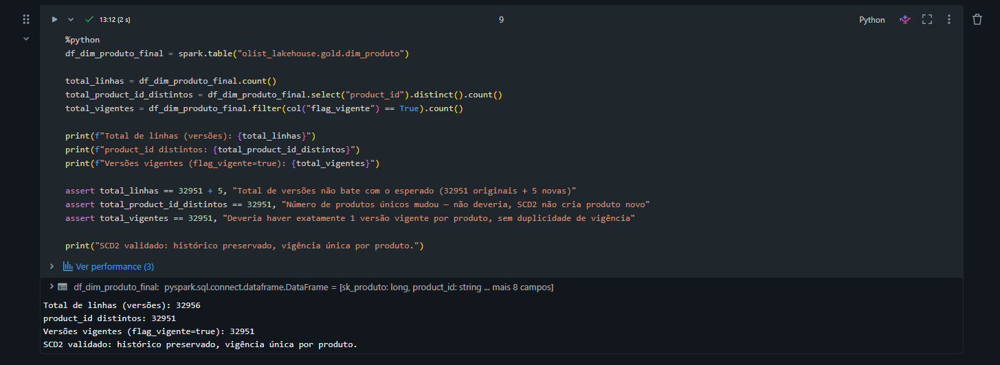

# olist-ecommerce-lakehouse

Pipeline de dados end-to-end sobre o dataset Olist Brazilian E-commerce, construído
como projeto de portfólio técnico em Azure Data Factory, ADLS Gen2 e Databricks
(Unity Catalog), seguindo a arquitetura medalhão (Bronze → Silver → Gold).

```
Dataset Olist → API própria (FastAPI) → Azure Data Factory → ADLS Gen2 (Bronze)
→ Databricks / Unity Catalog (Silver → Gold → Publish) → Consumo (SQL / Power BI)
```

---

## Arquitetura

| Camada | O que é | Onde vive |
|---|---|---|
| **Fonte** | API REST própria ([`olist-fake-api`](https://github.com/Dinhomald/olist-fake-api)), simula uma fonte externa servindo o dataset Olist paginado | Repo próprio, deploy no Render |
| **Bronze** | Arquivo cru, envelope de página completo preservado (JSON Lines), sem transformação | ADLS Gen2, container `bronze`: fora do Unity Catalog, intencionalmente |
| **Silver** | Dado explodido, tipado, schema explícito, validado por contagem e unicidade de chave | Tabelas Delta gerenciadas, `olist_lakehouse.silver.*` |
| **Gold** | Star Schema (Kimball): dimensões e fatos, granularidade definida, SCD2 em Dim Produto | Tabelas Delta gerenciadas, `olist_lakehouse.gold.*` |
| **Publish** | Views analíticas de consumo final, vocabulário de negócio, interface entre o modelo dimensional e quem consome (BI) | Views (sem storage físico), `olist_lakehouse.publish.vw_*` |

### Por que essa stack

Airflow já é dominado em produção (uso profissional). ADF foi escolha deliberada de
aprendizado, para abrir repertório em vagas com stack Microsoft; não por ser
tecnicamente superior ao que já era conhecido.

### Decisões de arquitetura

- **Sem camada Landing/Stage separada da Bronze.** Justificável apenas com múltiplas
  fontes heterogêneas convergindo; não é o caso aqui (fonte única).
- **Bronze fora do Unity Catalog, propositalmente.** É arquivo cru escrito pelo ADF,
  lido via `spark.read.json()` por path absoluto. Existe um schema lógico
  `olist_lakehouse.bronze` no catálogo, vazio, só como referência, nunca hospeda
  tabela gerenciada.
- **9 pipelines de ingestão separados (não parametrizados por ForEach).** Mesma
  lógica aplicada aos 9 notebooks de Silver (um por entidade). Decisão consciente
  para manter visibilidade de erro por unidade enquanto o domínio da stack estava
  em construção; parametrização é evolução futura, não bloqueador.
- **Full load, não incremental, na carga da Silver.** A fonte (dataset histórico
  estático) não expõe conceito de "delta" real, e a Bronze ainda não tem
  particionamento por data de ingestão: pré-requisitos que tornariam incremental
  seguro e testável. Decisão documentada, não lacuna.

---

## Camada Bronze

9 endpoints ingeridos via Azure Data Factory, com paginação nativa (`AbsoluteUrl` +
`next_page_url`), validados por contagem real de páginas, não apenas pelo status
"Efetuado com êxito" do ADF.

| Entidade | Registros | Páginas |
|---|---|---|
| category_translation | 71 | 1 |
| sellers | 3.095 | 31 |
| products | 32.951 | 330 |
| reviews | 99.224 | 993 |
| orders | 99.441 | 995 |
| customers | 99.441 | 995 |
| payments | 103.886 | 1.039 |
| order_items | 112.650 | 1.127 |
| geolocation | 1.000.163 | 10.002 |

## Camada Silver

Cada entidade em um notebook próprio (`silver_<entidade>`): leitura do JSON Lines
cru, schema explícito via `from_json(to_json(...))` (proteção contra schema drift),
conversão de tipos, validação por `assert` de contagem e unicidade de chave antes
da escrita como Delta gerenciada.

## Camada Gold: Star Schema (Kimball)

**Dimensões:**
- `dim_data`: calendário, chave `sk_data` no formato `YYYYMMDD`.
- `dim_geografia`: 1 linha por prefixo de CEP (19.015), critério de desempate
  determinístico via `row_number()`.
- `dim_produto`: **com SCD2 real**, ver seção dedicada abaixo.
- `dim_cliente`: grão de pessoa (`customer_unique_id`), não de pedido
  (`customer_id`). Endereço resolvido pelo pedido mais recente do cliente.
- `dim_vendedor`: grão de `seller_id`.

**Fatos:**
- `fato_vendas`: grão de item de pedido (112.650 linhas). Join com `dim_produto`
  respeita o intervalo de vigência SCD2 (não apenas "vigente hoje").
- `fato_pagamentos`: grão de pagamento (103.886 linhas).
- `fato_reviews`: grão `(review_id, order_id)`, não `review_id` isolado (ver achado
  de qualidade de dado abaixo).

Todas as FKs foram validadas por `LEFT JOIN` contra as dimensões correspondentes,
confirmando zero registro órfão em cada fato.

### SCD2 em Dim Produto

A fonte é um snapshot único, sem histórico real de mudança de atributo. Para
demonstrar o mecanismo de versionamento de forma genuína, uma mudança de categoria
foi simulada em 5 produtos reais, e o pipeline de `MERGE` foi construído e validado
completo:

1. Carga inicial: 32.951 produtos, todos como primeira versão vigente.
2. Detecção de mudança: comparação entre snapshot novo e versão vigente atual.
3. Fechamento da versão antiga (`flag_vigente = false`, `data_fim_vigencia`
   preenchida) via `MERGE`.
4. Inserção da nova versão vigente, nova `sk_produto`.

Resultado validado: 32.956 versões totais, 32.951 produtos únicos (nenhum produto
duplicado), 32.951 versões vigentes (exatamente 1 por produto, sem duplicidade).

---

## Achados de qualidade de dado

Identificados por validação numérica (contagem, unicidade de chave), não por erro
de execução; parte do processo de engenharia, não só "rodou sem erro".

**CEP truncado na API.** `pd.read_csv()` sem `dtype` explícito inferia colunas de
CEP (`geolocation_zip_code_prefix`, `customer_zip_code_prefix`,
`seller_zip_code_prefix`) como inteiro, perdendo o zero à esquerda antes mesmo da
serialização JSON. Corrigido na fonte (`olist-fake-api`), não com workaround na
Silver. Re-ingestão dos 3 endpoints afetados, revalidada.

**`review_id` não é chave primária isolada.** 814 valores de `review_id` se repetem
associados a `order_id` diferentes; comportamento real do dataset Olist original,
não bug de pipeline. Granularidade correta confirmada: `(review_id, order_id)`.
Isso foi respeitado na modelagem de `fato_reviews`.

---

## Camada Publish

Schema próprio (`olist_lakehouse.publish`), separado da Gold, mesmo padrão de
camada pós-modelagem dimensional usado profissionalmente em ambiente corporativo,
não uma view a mais dentro da Gold por conveniência.

**Por que uma camada separada, e não apenas views dentro de `gold`:**

- **Superfície de acesso menor.** Consumidores de BI recebem permissão de leitura
  só em `publish`: nunca acesso direto a `gold`, onde vivem as chaves compostas,
  surrogate keys e a lógica de SCD2 que não interessam a quem consome.
- **Contrato de interface estável.** Uma refatoração interna na Gold (renomear
  coluna, reestruturar um join) não quebra dashboard nenhum, desde que a view
  pública continue expondo a mesma forma.
- **Vocabulário de negócio, não vocabulário de modelagem.** `publish` expõe
  métricas prontas (`vw_receita_mensal`, `vw_satisfacao_categoria`) em vez de
  forçar quem consome a entender granularidade de fato ou versionamento SCD2.

Notebooks salvos como `.sql` (não `.py`), já que aqui é 100% SQL, mantém
sintaxe destacada no GitHub sem perder compatibilidade de import no Databricks.

**Custo:** próximo de zero em storage: views não armazenam dado físico, são
definição SQL recalculada a cada consulta. Por isso o schema `publish` não tem
`MANAGED LOCATION` própria, diferente de `bronze`/`silver`/`gold`.

**Views atuais:**

- `vw_receita_mensal`: receita, frete e ticket médio por mês.
- `vw_top_categorias`: receita e itens vendidos por categoria de produto.
- `vw_top_vendedores`: receita por vendedor e estado.
- `vw_satisfacao_categoria`: nota média de review por categoria.
- `vw_forma_pagamento`: distribuição e valor por tipo de pagamento.

**Views granulares** (não agregadas, espelhando fato/dimensões da Gold para
modelo relacional de BI): `vw_dim_data`, `vw_dim_produto`, `vw_dim_cliente`,
`vw_dim_vendedor`, `vw_fato_vendas`, `vw_fato_pagamentos`, `vw_fato_reviews`.
Detalhes da decisão em `notebooks/publish/README.md` e no log de sessões.

## Dashboard (Power BI)

Modelo relacional completo conectado via Databricks SQL Warehouse, consumindo
as views granulares de `publish`: cross-filtering real entre todos os visuais
(filtro de Ano/Mês/Estado/Categoria afeta receita, satisfação, forma de
pagamento simultaneamente).



Modelo relacional no Power BI, espelhando as views granulares de `publish`:



Arquivo `.pbix` disponível em `dashboard/olist-painel-analitico.pbix`.

---

## Evidências visuais

Prints das ferramentas configuradas via UI (sem código versionável tradicional).

**Azure Data Factory**

Orquestração dos 9 pipelines de ingestão, com `geolocation` isolado em paralelo:



Configuração final que resolveu o bloqueio de paginação da Sessão 01:



**ADLS Gen2**

Estrutura física do Data Lake, containers e arquivos crus da Bronze:




**Unity Catalog**

Catálogo e schemas no Databricks:



**SCD2 em Dim Produto**

Output real da validação do SCD2 (os 3 `assert` de integridade passando):



---

## Stack

- **Fonte:** FastAPI + pandas + uvicorn ([`olist-fake-api`](https://github.com/Dinhomald/olist-fake-api), deploy Render)
- **Orquestração:** Azure Data Factory
- **Storage:** ADLS Gen2, Hierarchical Namespace
- **Processamento e governança:** Databricks (Serverless), Unity Catalog, Delta Lake
- **Consumo:** SQL Warehouse (views) → Power BI

## Estado atual

- ✅ Ingestão Bronze: 9 endpoints, validados
- ✅ Unity Catalog: catálogo e schemas configurados (Access Connector, Storage
  Credential, External Locations)
- ✅ Silver: 9 entidades, validadas
- ✅ Gold: 5 dimensões + 3 fatos, SCD2 demonstrado, integridade referencial validada
- ✅ Publish: 12 views (5 agregadas + 7 granulares), governança documentada
- ✅ Power BI: dashboard completo, modelo relacional com cross-filtering real
- 🔲 CI/CD (Azure DevOps): planejado, não implementado

### Adiado conscientemente (não bloqueia o projeto)

- ForEach parametrizado no ADF (9 pipelines separados por decisão de visibilidade
  de debug)
- Particionamento de data na Bronze
- Carga incremental via `MERGE` na Silver (full load por enquanto)
